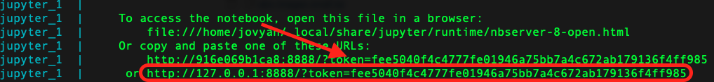

# Visual and Semantic Similarity with Redis

This demo goes along with the [Annoucement of a New Redis Vector Similarity Search](https://redis.com/blog/build-intelligent-apps-redis-vector-similarity-search/)

You will experiment with two key applications of Vector Similarity Search application using a realistic dataset:

* Semantic Search: Given a sentence check products with semantically similar text in the product keywords
* Visual Search: Given a query image, find the Top K most "visually" similar in the catalogue

# About the Amazon Product dataset
The CSV product data used in this demo was derived from the ["Amazon Berkeley Objects Dataset"](https://amazon-berkeley-objects.s3.amazonaws.com/index.html)

Each row in the CSV file correspond to a product in the original dataset.


# Before you start
* Install [Git LFS](https://git-lfs.github.com/)
    * Make sure you initialize LFS by runing
    ```
    git lfs install
    ```
* Docker
* [Docker Compose](https://docs.docker.com/compose/install/)

# Clone the Repo 
```
git clone https://github.com/RedisAI/vecsim-demo.git
```
# Fire Up the Docker containers
Use docker-compose to start up 2 containers:
* vesim: A redis container with Vector Similarity Search (VSS) on port 6379
* jupyter: A python notebook server on port 8888 pre-loaded with 4 notebooks
    * 2 notebooks illustrating how to perform Visual Similarity with Redis VSS
    * 2 notebooks illustrating how to perform semantic Similarity with Redis VSS
```
cd vecsim-demo
docker-compose up
```
**NOTE**: The first time you run the above command, it will take 5-10 minutes (depending on your network)
The jupyter container downloads a 3.25GB tar file with product images from the ["Amazon Berkeley Objects Dataset"](https://amazon-berkeley-objects.s3.amazonaws.com/index.html)

# Launch the Jupyter Notebooks
Monitor the logs and look out for the link to launch jupyter on your local machine


Open a local browser to this link


# Step 1: Semantic Similarity - Part I
Open this notebook [http://127.0.0.1:8888/notebooks/SemanticSearch1k.ipynb](http://127.0.0.1:8888/notebooks/SemanticSearch1k.ipynb)

Run All Cells and check the outputs

You will generate embeddings for 1,000 products and perform semantic similarity using two indexing methods(HNSW and brute-force)

# Step 2: Semantic Similarity - Part II
Open this notebook [http://127.0.0.1:8888/notebooks/SemanticSearch100k.ipynb](http://127.0.0.1:8888/notebooks/SemanticSearch100k.ipynb)

Run All Cells and check the outputs

You will load ~100k previously-generated embeddings for the first 100,000 products in the dataset.
You'll perform semantic similarity on a larger dataset

# Step 3: Visual Similarity - Part I
Open this notebook [http://127.0.0.1:8888/notebooks/VisualSearch1k.ipynb](http://127.0.0.1:8888/notebooks/VisualSearch1k.ipynb)

Run All Cells and check the outputs

You will generate embeddings for 1,000 product images and perform visual similarity using two indexing methods

# Step 4: Visual Similarity - Part II
Open this notebook [http://127.0.0.1:8888/notebooks/VisualSearch100k.ipynb](http://127.0.0.1:8888/notebooks/VisualSearch100k.ipynb)

You'll perform visual similarity on a larger dataset using two indexing methods (HNSW and brute-force)

# Stop the Docker containers
```
docker-compose down
```

# About the Amazon Product data
The dataset used in this demo was derived from the ["Amazon Berkeley Objects Dataset"](https://amazon-berkeley-objects.s3.amazonaws.com/index.html)

In particular, each long text field in the product_data.csv was extracted from the original JSON encoded object representing each product. 

Thanks to Amazon.com for sharing the original dataset. This includes all product data, images and 3D models under the [Creative Commons Attribution-NonCommercial 4.0 International Public License (CC BY-NC 4.0)](https://creativecommons.org/licenses/by-nc/4.0/)

Credit to the creators of the dataset: 
Matthieu Guillaumin Amazon.com 
Thomas Dideriksen Amazon.com 
Kenan Deng Amazon.com 
Himanshu Arora Amazon.com 
Arnab Dhua Amazon.com 
Xi (Brian) Zhang Amazon.com 
Tomas Yago-Vicente Amazon.com 
Jasmine Collins UC Berkeley 
Shubham Goel UC Berkeley 
Jitendra Malik UC Berkeley
